# GitHub Readme Stats

Dynamically generated GitHub stats cards for your README.


[English](README.md) · [繁體中文](README-zh.md)

## Table of contents

- [Quick Start](#quick-start)
- [GitHub Stats Card](#github-stats-card)
- [Top Languages Card](#top-languages-card)
- [Repository Card](#repository-card)
- [Gist Card](#gist-card)
- [WakaTime Card](#wakatime-card)
- [Deployment](#deployment)
- [Configuration](#configuration)
- [API Documentation](#api-documentation)
- [Support](#support)
- [Contributing](#contributing)
- [Important Notes](#important-notes)

## Quick Start

1. **Deploy your instance** — follow [Deployment](#deployment) until you have a working Workers URL. Verify in a browser:

  `https://YOUR-INSTANCE.WORKERS.DEV/api?username=YOUR_USERNAME`
2. **Add this to your README** (replace placeholders with your Workers hostname and GitHub username):

```markdown

```

## GitHub Stats Card

Display your GitHub statistics including stars, commits, pull requests, and more.



### Basic Usage

```markdown

```

### Examples

**Use a theme:**

```markdown

```

**Custom colors:**

```markdown

```

### Responsive Themes

Use GitHub's theme context tags for automatic dark/light mode:

```markdown
[](https://github.com/YOUR_USERNAME)
[](https://github.com/YOUR_USERNAME)
```

See [all available themes](themes/README.md). All options: [API.md — Stats Card](API.md#1-stats-card).

## Top Languages Card

Display your most frequently used programming languages.



### Basic Usage

```markdown

```

### Examples

**Compact layout:**

```markdown

```

**Donut chart:**

```markdown

```

All options: [API.md — Top Languages Card](API.md#2-top-languages-card).

## Repository Card

Pin additional repositories beyond GitHub's 6-repo limit.



### Basic Usage

```markdown

```

### Example

```markdown

```

All options: [API.md — Repository Card](API.md#3-repository-card).

## Gist Card

Display GitHub Gists in your README.



### Basic Usage

```markdown

```

### Example

```markdown

```

All options: [API.md — Gist Card](API.md#4-gist-card).

## WakaTime Card

Display your WakaTime coding statistics.



> [!WARNING]
> Your WakaTime profile must be public. Enable both "Display code time publicly" and "Display languages, editors, os, categories publicly" in your WakaTime settings.

### Basic Usage

```markdown

```

### Example

```markdown

```

All options: [API.md — WakaTime Card](API.md#5-waka-time-card).

## Deployment

### Prerequisites

1. **Node.js 22+** (matches this repo's `engines` field)
2. **GitHub Personal Access Token (PAT)** — **required.** Set `GITHUB_PAT` as a Worker secret. Scope at [GitHub token settings](https://github.com/settings/tokens): public stats need `read:user`; private stats need `repo` + `read:user` (see [Important Notes](#important-notes)).

### Deploy to Cloudflare Workers

1. **Fork this repository**
2. **Install dependencies:** `pnpm install` (install [pnpm](https://pnpm.io/) with `npm install -g pnpm` if needed)
3. **Configure:** `node scripts/generate-wrangler-config.js` — then `pnpm wrangler secret put GITHUB_PAT` for production
4. **Deploy:** `pnpm run deploy` — in **Workers Builds**, use `pnpm run deploy` (not bare `wrangler`). Set `GITHUB_PAT`; optional GitHub Actions secrets: `CLOUDFLARE_API_TOKEN`, `CLOUDFLARE_ACCOUNT_ID`
5. **Use** `https://YOUR-INSTANCE.WORKERS.DEV` in your README embed URLs

### Environment Variables


| Variable        | Description                                                 |
| --------------- | ----------------------------------------------------------- |
| `GITHUB_PAT`    | GitHub PAT (required); add `GITHUB_PAT_2`, … for more quota |
| `WHITELIST`     | Comma-separated allowed usernames                           |
| `CACHE_SECONDS` | Default cache duration in seconds (`0` disables)            |


Full list: [API.md — Environment Variables](API.md#environment-variables).

> [!WARNING]
> Redeploy after changing environment variables.

> [!IMPORTANT]
> For internet-reachable instances, set `WHITELIST` to intended usernames. Unset `WHITELIST` lets any username consume your GitHub quota. If you expose `/api/gist`, set `GIST_WHITELIST` to allowed gist IDs.

Use [Sync Fork](https://docs.github.com/en/pull-requests/collaborating-with-pull-requests/working-with-forks/syncing-a-fork) to pull upstream changes; redeploy and re-check secrets after syncing.

## Configuration

### Aligning Cards Side by Side

```markdown
[](https://github.com/YOUR_USERNAME)
[](https://github.com/YOUR_USERNAME)
```

### Locales

Set `locale=` on any card URL (e.g. `&locale=es`). Supported codes: [API.md — Supported Locales](API.md#supported-locales).

### Caching

Each card type has default cache durations and per-card min/max clamps for `cache_seconds`; override globally with `CACHE_SECONDS`. Details: [API.md — Cache Durations](API.md#cache-durations).

## API Documentation

Full reference: [API.md](API.md), [hosted docs](https://github-readme-stats-api-docs.pages.dev/), or [openapi.yaml](openapi.yaml).

## Support

If something is not working:

- Confirm your Workers URL loads in a browser (see [Quick Start](#quick-start))
- Check PAT scopes and private-stats caveats in [Important Notes](#important-notes) and [Deployment](#deployment)
- For WakaTime cards, confirm profile visibility under [WakaTime Card](#wakatime-card)
- Open an [issue](https://github.com/dytsou/github-readme-stats/issues) with the failing URL (redact secrets)

### When things go wrong

Card endpoints return **error SVGs** (not JSON) for most failures:


| What you see                       | Likely cause                                                                  |
| ---------------------------------- | ----------------------------------------------------------------------------- |
| Missing username / parameter error | `username` (or `repo`, `id`) not in the URL                                   |
| User not found                     | GitHub username typo or organization name used as `username`                  |
| Rate limit / downtime message      | GitHub API quota exhausted — add `GITHUB_PAT_2`, tighten `WHITELIST`, or wait |
| No tokens / PAT message            | `GITHUB_PAT` secret not set on the Worker                                     |
| WakaTime user not found            | WakaTime profile or visibility settings (see [WakaTime Card](#wakatime-card)) |


Full error shapes: [API.md — Error Handling](API.md#error-handling).

## Contributing

Contributions welcome — star the repo, [open issues](https://github.com/dytsou/github-readme-stats/issues), or send PRs.

## Important Notes

> [!IMPORTANT]
> **This fork is self-host-only** — deploy your own Cloudflare Workers instance; there is no shared public demo URL in this repo. The GitHub API allows 5k requests per hour per PAT. Caching reduces repeat GitHub API hits for the same card URL; it does **not** guarantee staying under the limit when many usernames are requested, caches expire, or `CACHE_SECONDS` is `0`. Set `WHITELIST` to the usernames you intend to serve, and add `GITHUB_PAT_2` (and further) tokens if you need more quota.

> [!WARNING]
> By default, cards only show statistics from public repositories. To include private repository statistics, deploy your own instance with a GitHub Personal Access Token that belongs to the **same user** as `username`. Private-repo aggregates rendered this way are still served on the **public card URL** — treat that as intentional disclosure, restrict the instance with `WHITELIST`, and do not embed the URL where those totals should stay private. Organization or SSO-restricted private repos may remain invisible even with a PAT.

